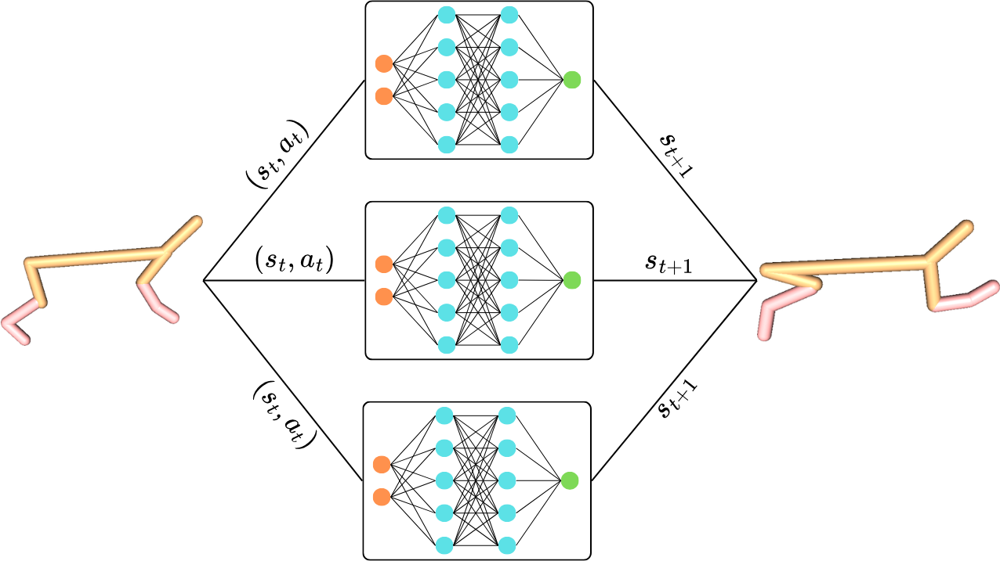

# Learning RL Dynamics with Neural Network Ensembles

This repository contains the implementation of my MSc thesis work (link [here](https://ulb-dok.uibk.ac.at/ulbtirolhs/content/titleinfo/12445583)) on learning environment dynamics with neural network ensembles. The project explores deterministic vs probabilistic ensemble models for dynamics learning on D4RL benchmark datasets, and tracks training/evaluation with MLflow.

<!--  -->
<p align="center">
  
</p>

# Project Overview

- Implements ensemble neural networks for dynamics modeling:
  - Deterministic ensembles
  - Probabilistic ensembles
- Evaluates performance on D4RL datasets (commonly used for offline RL 
research).
- Logs metrics and artifacts using MLflow for experiment tracking.

The goal is to analyze how ensemble type (deterministic vs probabilistic) affects model quality and stability in learned dynamics models.

Repository Structure
```bash
.
├─ train_ensemble.py # Learns an ensemble of dynamics models
├─ models
|  ├ dynamics_model.py # Definition of general dynamics model
|  ├ deterministic_model.py # Definition of deterministic model
|  ├ probabilistic_model.py # Definition of probabilistic model
|  ├ utils.py # Generic functions and classes
├─ configs/ # Configuration files
├─ mlruns/ # Will contain tracked MLflow runs
├─ logs/ # Saved csv logs
├─ requirements.txt # Python dependancies
└── README.md
```

# Installation

The project was tested with Python 3.10.18. It is recommended to use ```pyenv``` to create a new virtualenv.

```bash
git clone https://github.com/AndrewKM210/dynamics-ensembles-rl.git
cd dynamics-ensembles-rl
pip install -r requirements.txt
pip install -e .
```

# Usage

The available datasets can be found in the Gym section of the following link:
- https://github.com/Farama-Foundation/d4rl/wiki/Tasks

Learn the dynamics of a D4RL dataset with a configuration file and store to file:
```bash
python train_ensemble.py --dataset hopper-medium-v0 --config configs/dnn.yaml --output ensemble.pkl
```

Parameters in the configuration files can be replaced for testing:
```bash
python train_ensemble.py --dataset hopper-medium-v0 --config configs/dnn.yaml --params fit_epochs=100 hidden_size=256,256
```

Use a holdout split of the dataset to track validation loss:
```bash
python train_ensemble.py --dataset hopper-medium-v0 --config configs/dnn.yaml --holdout_ratio 0.2 --track_training
```

With ```--track_training``` all training metrics will be logged in each epochs. Otherwise, the script prioritizes execution time and skips expensive non-essential metrics. The metrics are logged to MLflow. To view them use the following command and open http://127.0.0.1:5000: 
```bash
mlflow ui --port 5000
```

Additionally, save tracked metrics to a specified csv file for analyzing and plotting:
```bash
python train_ensemble.py --dataset hopper-medium-v0 --config configs/dnn.yaml --csv logs/hopper_dnn.csv --track_training
```
# Results

The following plots show the train and validation Mean Squared Error (MSE) loss while training different 2 neural network ensembles on D4RL's halfcheetah-medium-v0 dataset. Even though the deterministic ensemble achieves a better train loss, the probabilistic ensemble outperforms in the validation loss. Not using a learning rate scheduler for the probabilistic ensemble leads to unstable losses.

<picture>
    <source media="(prefers-color-scheme: dark)" srcset="assets/loss_train_dark.png">
    
</picture>

<picture>
    <source media="(prefers-color-scheme: dark)" srcset="assets/loss_val_dark.png">
    
</picture>

# References

- Fu et al. D4RL: Datasets for Deep Data-Driven Reinforcement Learning. NeurIPS 2020.
- Chua et al. Deep Reinforcement Learning in a Handful of Trials using Probabilistic Dynamics Models (PETS). NeurIPS 2018.
- Kidambi et al. MOReL: Model-Based Offline Reinforcement Learning. NeurIPS 2020.
- MLflow: https://mlflow.org
